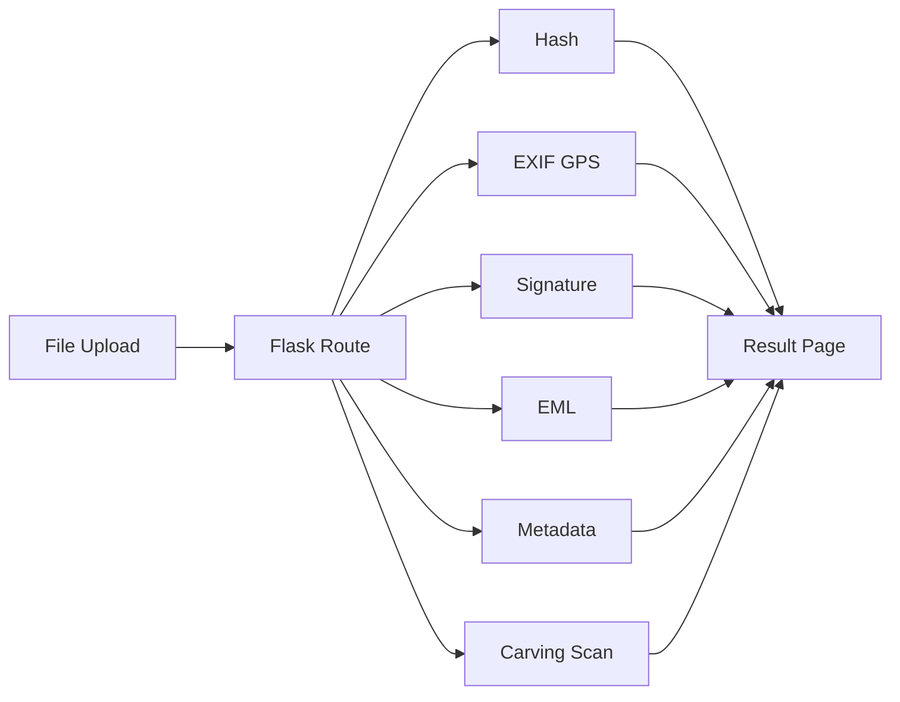

# Digital Forensics Analysis Platform

**웹 기반 디지털 포렌식 분석 플랫폼**

파일·이미지·이메일 등 다양한 디지털 데이터를 하나의 웹 환경에서 분석할 수 있도록 구성한 Flask 기반 포렌식 프로젝트입니다.

> 이 저장소는 2026년 프로젝트 진행 당시 대화 기록, 포트폴리오 자료, 서버 구축 기록을 바탕으로 소스 구조를 다시 정리한 **복원/정리본**입니다. 기능과 사용 기술은 당시 프로젝트 기록에 맞추었고, 원문 코드가 남아 있지 않은 일부 파일은 동일 기능이 동작하도록 재구성했습니다.

---

## Main Functions

- **Hash Analysis** — MD5 / SHA1 / SHA256 해시 계산
- **Photo GPS Extraction** — `exifread`를 이용한 EXIF GPS 좌표 추출
- **Signature Analysis** — 파일 헤더를 이용한 실제 파일 형식 판별
- **Email Analysis** — `.eml` 발신자·수신자·제목·본문·첨부파일 분석
- **Metadata Analysis** — 이미지 형식·크기·EXIF 메타데이터 확인
- **File Carving Scan** — JPG / PNG / GIF / ZIP 시그니처의 파일 내부 Offset 탐색

---

## Technology

`Python` `Flask` `HTML/CSS` `Ubuntu Server` `Gunicorn` `Nginx`

Python libraries: `hashlib` · `exifread` · `email` · `Pillow`

---

## Analysis Flow



---

## Project Structure

```text
.
├── app.py
├── requirements.txt
├── static/
│   └── style.css
├── templates/
│   ├── base.html
│   ├── dashboard.html
│   ├── hash.html
│   ├── gps.html
│   ├── signature.html
│   ├── email.html
│   ├── metadata.html
│   └── carving.html
├── utils/
│   ├── hash_utils.py
│   ├── gps_utils.py
│   ├── signature_utils.py
│   ├── email_utils.py
│   ├── metadata_utils.py
│   └── carving_utils.py
└── docs/
    └── deployment.md
```

---

## Run

```bash
python3 -m venv venv
source venv/bin/activate
pip install -r requirements.txt
python app.py
```

브라우저에서 `http://127.0.0.1:5000`으로 접속합니다.

Ubuntu 배포 기록은 [`docs/deployment.md`](docs/deployment.md)를 참고하세요.

---

## What I Implemented

- Flask 프로젝트 및 기능별 라우팅 구성
- 브라우저 파일 업로드 → 서버 분석 → 결과 출력 흐름 구현
- MD5 / SHA1 / SHA256 해시 분석
- EXIF GPS 추출
- 파일 Header Signature 판별
- `.eml` 구조 분석
- 이미지 Metadata 분석
- 기능별 Web Dashboard 구성
- Ubuntu + Gunicorn + Nginx 환경에서 서비스 실행/트러블슈팅

---

## Portfolio Summary

> 포렌식 실습에서 사용한 개별 분석 기능을 하나의 Flask 웹 서비스로 통합하여, 사용자가 파일을 업로드하고 해시·위치·시그니처·이메일·메타데이터 정보를 웹에서 바로 확인할 수 있도록 구현한 프로젝트입니다.
