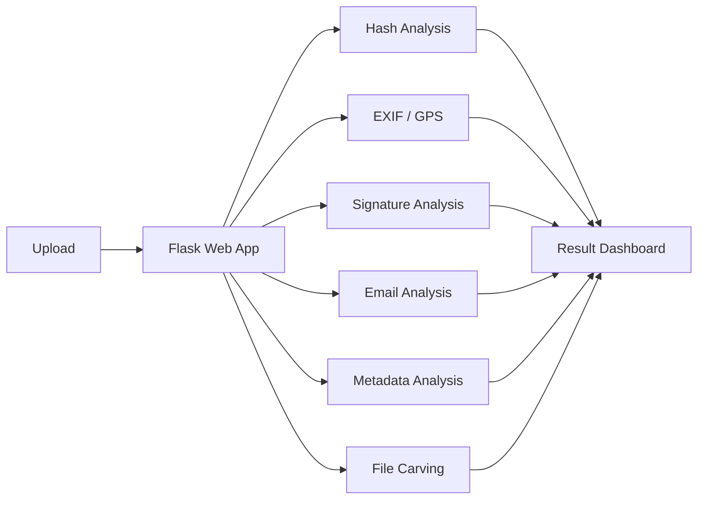

# Digital Forensics Analysis Platform

**웹 기반 디지털 포렌식 분석 플랫폼**

파일·이미지·이메일 등 다양한 디지털 데이터를 하나의 웹 환경에서 분석할 수 있도록 구성한 포렌식 프로젝트입니다.

---

## Project Overview

사용자가 분석 대상을 업로드하면 기능별 분석 모듈에서 데이터를 처리하고, 결과를 Flask 기반 웹 대시보드에서 확인할 수 있도록 구성했습니다.

### Main Functions

- **Hash Analysis** — 업로드한 파일의 MD5, SHA1, SHA256 해시값 계산
- **Photo GPS Extraction** — 이미지 EXIF 메타데이터에서 GPS 정보 추출
- **Signature Analysis** — 파일 헤더/시그니처를 분석하여 실제 파일 형식 판별
- **Email Analysis** — `.eml` 파일의 발신자, 수신자, 제목, 날짜, 본문, 첨부파일 정보 분석
- **Metadata Analysis** — 이미지 형식, 크기, 해상도, EXIF 등 메타데이터 분석
- **File Carving** — 업로드 파일에서 JPG, GIF, PNG, ZIP 등의 시그니처 탐지

---

## Technology

`Python` `Flask` `HTML` `CSS` `Linux`

---

## Analysis Flow

---

## What I Learned

- 파일 포맷과 메타데이터 구조 이해
- 해시값을 활용한 파일 무결성 확인
- EXIF 기반 위치 정보 추출
- 파일 시그니처를 이용한 실제 형식 판별
- EML 구조 파싱 및 이메일 정보 분석
- 여러 분석 기능을 Flask 웹 인터페이스로 통합

---

## Portfolio Summary

> 여러 디지털 분석 기능을 하나의 웹 대시보드로 통합하여, 사용자가 업로드한 파일의 해시·위치·시그니처·이메일·메타데이터 정보를 빠르게 확인할 수 있도록 구현한 프로젝트입니다.

